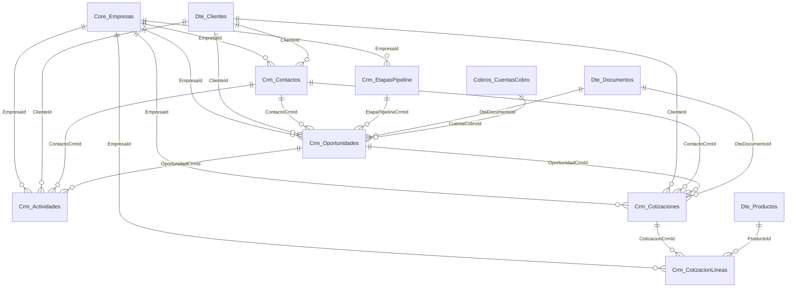

# NEOCRM Schema V2-C1

Fecha de corte: 2026-06-09.

Este documento fija el esquema de datos de NEOCRM 114 para la fase V2-C1. El objetivo es soportar el flujo comercial:

`contacto -> oportunidad -> cotizacion -> DTE -> cobro`

El cierre de esta entrega es de esquema backend/API-first. La UI y los endpoints especificos de cotizacion quedan sobre este modelo.

## Modulo

| Elemento | Valor |
|---|---|
| Modulo | `NEOCRM` |
| Id | `114` |
| Planes | Pro `202`, BusinessFull `203`, Enterprise `204` |
| Permisos | `Crm.Contactos.*`, `Crm.Oportunidades.*`, `Crm.Actividades.*` |

## Tablas

| Tabla | Proposito |
|---|---|
| `Crm_Contactos` | Personas de seguimiento comercial, opcionalmente vinculadas a `Dte_Clientes`. |
| `Crm_EtapasPipeline` | Etapas configurables por empresa para pipeline y probabilidad. |
| `Crm_Oportunidades` | Negocios potenciales, monto estimado, etapa, probabilidad y cierre. |
| `Crm_Actividades` | Llamadas, correos, visitas, tareas o notas vinculadas a oportunidad/contacto/cliente. |
| `Crm_Cotizaciones` | Propuesta comercial versionable antes de generar DTE. |
| `Crm_CotizacionLineas` | Detalle de productos/servicios de una cotizacion. |

## Relaciones

## Estados

| Entidad | Estados |
|---|---|
| Contacto | `ACTIVO`, `INACTIVO` |
| Oportunidad | `ABIERTA`, `GANADA`, `PERDIDA`, `ANULADA` |
| Actividad | `PENDIENTE`, `REALIZADA`, `CANCELADA` |
| Cotizacion | `BORRADOR`, `ENVIADA`, `ACEPTADA`, `RECHAZADA`, `CONVERTIDA`, `ANULADA` |

## Pipeline default

El servicio crea etapas por empresa cuando no existen:

| Codigo | Orden | Probabilidad | Cierre |
|---|---:|---:|---|
| `LEAD` | 10 | 10 | No |
| `CALIFICADA` | 20 | 25 | No |
| `PROPUESTA` | 30 | 50 | No |
| `NEGOCIACION` | 40 | 75 | No |
| `GANADA` | 90 | 100 | Ganada |
| `PERDIDA` | 99 | 0 | Perdida |

## Indices clave

| Tabla | Indices |
|---|---|
| `Crm_Contactos` | `(EmpresaId, EstadoCodigo)`, `(EmpresaId, Nombre)` |
| `Crm_EtapasPipeline` | `(EmpresaId, Codigo)` unico, `(EmpresaId, Orden)` |
| `Crm_Oportunidades` | `(EmpresaId, EstadoCodigo)`, `(EmpresaId, EtapaPipelineCrmId)`, `(EmpresaId, ClienteId)` |
| `Crm_Actividades` | `(EmpresaId, EstadoCodigo, FechaProgramada)`, `(EmpresaId, OportunidadCrmId)` |
| `Crm_Cotizaciones` | `(EmpresaId, Numero)` unico, `(EmpresaId, EstadoCodigo, FechaEmision)`, `(EmpresaId, OportunidadCrmId)` |
| `Crm_CotizacionLineas` | `(EmpresaId, CotizacionCrmId)` |

## Migraciones

| Migracion | Contenido |
|---|---|
| `20260609214258_V2_C1_NeoCrm` | Tablas base CRM, modulo `NEOCRM`, planes y permisos. |
| `20260609223000_V2_C1_NeoCrm_Cotizaciones` | Cotizaciones y lineas de cotizacion. |

## Contrato API actual

Los endpoints disponibles cubren contactos, etapas, oportunidades, actividades y resumen:

- `GET /api/crm/resumen`
- `GET/POST /api/crm/contactos`
- `GET/PUT /api/crm/contactos/{id}`
- `POST /api/crm/contactos/{id}/inactivar`
- `GET/POST /api/crm/etapas`
- `PUT /api/crm/etapas/{id}`
- `GET/POST /api/crm/oportunidades`
- `GET/PUT /api/crm/oportunidades/{id}`
- `POST /api/crm/oportunidades/{id}/etapa`
- `GET/POST /api/crm/actividades`
- `POST /api/crm/actividades/{id}/completar`
- `POST /api/crm/actividades/{id}/cancelar`

## Pendiente sobre este esquema

- Servicio `ICrmCotizacionService` para CRUD de cotizaciones y calculo de totales.
- Endpoints `/api/crm/cotizaciones`.
- Accion `convertir-a-dte` que cree `DteDocumento` y marque cotizacion como `CONVERTIDA`.
- UI Web con pipeline visual, ficha de oportunidad y cotizacion imprimible.
